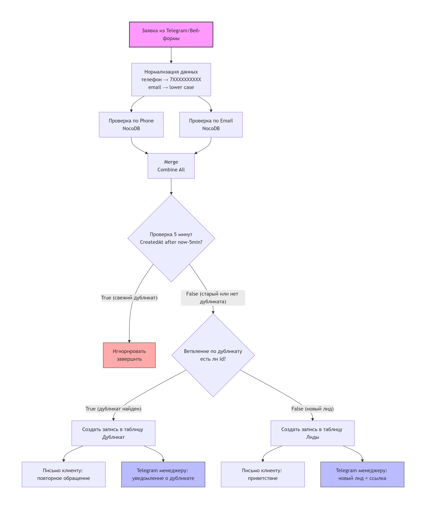

# 🔍 Проверка дубликатов перед внесением в CRM

Автоматизация на n8n для приёма заявок, поиска дубликатов по телефону или email, ветвления логики с отправкой уведомлений менеджерам и клиентам.

## 📋 Содержание
- [Описание](#описание)
- [Архитектура](#архитектура)
- [Требования](#требования)
- [Установка и настройка](#установка-и-настройка)
- [Скриншоты](#скриншоты-основные)
- [Документация](#документация)
- [Лицензия](#лицензия)

## 📌 Описание
Workflow решает задачу **ручной проверки дубликатов** заявок в CRM. При поступлении заявки через веб‑форму:

1. **Нормализация** телефона (единый формат `7XXXXXXXXXX`) и email (lowercase, trim).
2. **Параллельная проверка** по полям `Phone` и `Email` в таблице NocoDB.
3. **Ветвление**:
   - 🆕 **Новый лид** → запись в таблицу «Лиды», приветственное письмо клиенту, Telegram менеджеру со ссылкой.
   - 🔁 **Дубликат** → запись в таблицу «Дубликаты», повторное письмо клиенту, предупреждение менеджеру.
4. **Защита от спама** – если дубликат создан менее 5 минут назад, заявка игнорируется (ничего не создаётся, уведомления не отправляются).
5. **Глобальный Error Handler** – отдельный workflow ловит ошибки, отправляет сообщение администратору в Telegram и записывает сбой в Google Sheets.

## Архитектура

  

## 📦 Требования
Перед установкой убедитесь, что у вас есть:

- **n8n** (self‑hosted, версия 2.0 или выше)
- **NocoDB** с двумя таблицами:
  - `Лиды` – для первичных заявок
  - `Дубликаты` – для повторных обращений
- **Telegram Bot** (токен, `chat_id` менеджера и администратора)
- **SMTP сервер** (для отправки писем)
- **Google Sheets** (опционально, но рекомендуется для логов ошибок)

## 🚀 Установка и настройка
1. Импортируйте два workflow из папки `workflows/` в ваш n8n.
2. Настройте credentials:
   - NocoDB API Token
   - Telegram API (Telegram_bot)
   - SMTP (dxxxxxx@bk.ru)
   - Google Sheets OAuth2
3. Проверьте переменные окружения: workspaceId, projectId, таблицы (mwclrxvlb...., m2z.....7iytm), chat_id.
4. Активируйте оба workflow.
5. В основном workflow укажите в поле `errorWorkflow` ID обработчика (в настройках workflow).

## 📸 Скриншоты (основные)
Все скриншоты находятся в папке [`screenshots`](./screenshots):
- `canvas.png` – общий вид основного workflow
- `new_lead_telegram.png` – уведомление менеджеру о новом лиде
- `duplicate_telegram.png` – уведомление о дубликате
- `new_lead_email.png` – письмо клиенту
- `duplicate_email.png` – письмо при дубликате
- `nocodb_leads_table.png` – таблица Лиды
- `error_handler_telegram.png` – сообщение об ошибке администратору

## 📚 Документация
- [Техническое задание](docs/technical_specification.md)
- [Руководство пользователя](docs/user_manual.md)

## 📄 Лицензия
MIT (см. файл LICENSE)[`LICENSE`](./LICENSE.txt)

## 👤 Автор
Студия автоматизации бизнеса
Telegram: @ваш_канал
Пример workflow проверен в production на n8n версии 2.11.4.

💡 Готовое решение «под ключ» – настройка, интеграция с вашей CRM, адаптация под бизнес‑процессы. Обращайтесь!
